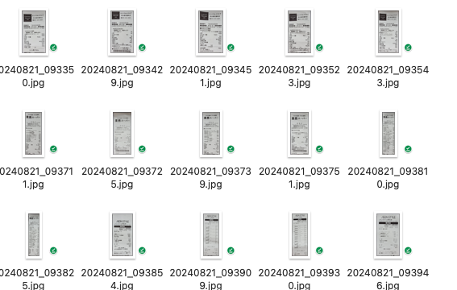

# **ResNetを使用した画像分類（スーパーの領収書を例として）**
本プロジェクトでは、ResNetアーキテクチャを使用した画像分類モデルを実装します。データセットには複数のクラスが含まれており、PyTorchを使用してモデルを訓練します。手順には、データの前処理、モデルの訓練、評価、デバッグ用のユーティリティ（サンプル画像の保存や訓練進捗の可視化）が含まれます。

## **Table of Contents**
- [プロジェクト概要](#プロジェクト概要)
- [データセット](#データセット)
- [モデルアーキテクチャー](#デルアーキテクチャー)
- [インストール](#インストール)
- [使用方法](#使用方法)
- [トレーニングと評価](#トレーニングと評価)
- [結果](#結果)
- [貢献](#貢献)
- [ライセンス](#ライセンス)

## **プロジェクト概要**

このプロジェクトは、**ResNet34** アーキテクチャに基づいたディープラーニングモデルを使用した画像分類をデモンストレーションするものです。主な構成要素は以下の通りです
This project demonstrates image classification using a deep learning model based on the **ResNet34** architecture. The key components include:

**データ拡張と前処理**：入力画像に適用される変換処理（リサイズや正規化など）。
**モデルのトレーニングと検証** ：損失計算、逆伝播、オプティマイザの更新を含む処理。
**デバッグツール**：トレーニング中にサンプル画像を保存および可視化する機能。
**プロット機能**：データ探索中に各クラスからランダムに選んだサンプルを可視化する機能。

## **データセットを準備**

Train、Val、predictionを三つのフォルダーを作ります。

  

   

## **モデルアーキテクチャー**

このプロジェクトでは、画像分類のバックボーンアーキテクチャとして**ResNet3**4を使用しています。ResNetの主な特徴は以下の通りです：

**Residual Blocks 残差ブロック**：スキップ接続を活用し、より深い層をトレーニング可能にする。

**Convolutional Layers 畳み込み層**：画像から特徴を抽出するために使用される。

**Fully Connected Layer 全結合層**：異なるカテゴリに分類するために使用される。

## **使用方法**

### 1.データ前処理

* [dataloader.py](datamodule/dataloader.py)  

このデータセットは、dataset_module内で定義されているRotatedReceiptDatasetクラスを使用して読み込まれます。

データは以下の変換処理を用いて前処理されます：
**Resize リサイズ**：すべての画像を224x224ピクセルにリサイズ。
**Normalization　正規化**：各RGBチャンネルごとに[0.5, 0.5, 0.5]に正規化。

データローダーを使用して回転画像を準備し、以下の4つのクラスで構成されるデータセットを作成します：

1.	元の画像（クラス1）
2.	左に90°回転した画像（クラス2）
3.	左に180°回転した画像（クラス3）
4.	右に90°回転した画像（クラス4）

  

### 2. トーレニングと評価
* [data_load_train.py](data_load_train.py) を行っています。

深層学習モデルResNet34を使用して、回転されたレシート画像の分類トレーニングと検証を行うことです。
カスタムデータセットRotatedReceiptDatasetを用いて、トレーニングと検証用データをロードし、データの拡張やサイズ変換（224x224への調整）を適用します。
PyTorchフレームワークを使用してResNet34モデルを定義し、損失関数として交差エントロピー損失（CrossEntropyLoss）を採用し、Adamオプティマイザでトレーニングを行います。

コードはトレーニングと検証の2つのフェーズに分かれています。トレーニングフェーズでは、複数のイテレーションを通じてモデルの重みを更新し、検証フェーズでは分類精度（test AP）を評価します。また、学習率スケジューラ（例: StepLR）を使用して学習率を動的に調整し、トレーニングの安定性を向上させます。各エポック終了後には、モデルの重みを保存し、将来の推論や利用に備えます。

さらに、ランダムなサンプル情報の表示、データの可視化、デバッグ用の初回バッチ画像の保存などの便利な機能も備えています。この全体的なプロセスは、レシートの回転角度を正確に分類する画像分類タスクに適しています。

   

### 3. prediction
* [prediction.py](prediction.py) を使います。

このコードはResNet34モデルを用いてレシート画像の回転角度を予測し、0°に補正する処理を行います。画像を読み込み、データ変換を適用し、モデルで分類後、結果に基づき画像を回転補正。補正前後の画像を表示します。

   

### Reference

