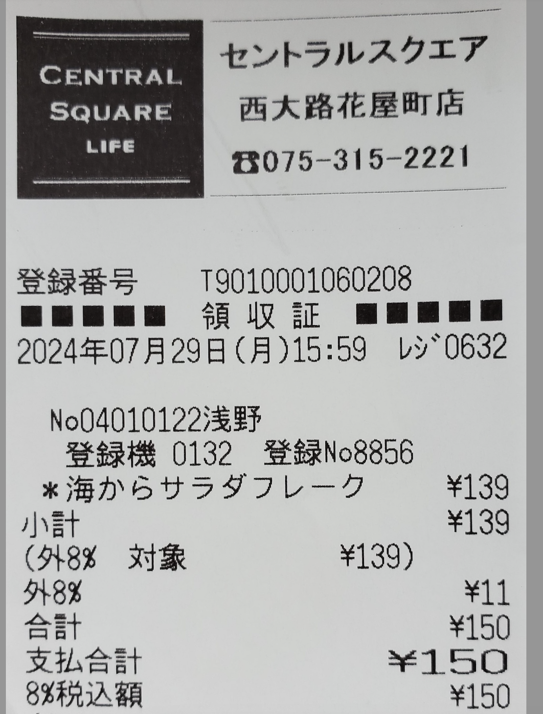

# **領収書向を補正モデル（分類モデル）**

## **概要**
本プロジェクトでは、ResNetを基盤とした分類モデルを使用し、領収書画像の回転角度（0°, 90°, 180°, 270°）を判別します。その後、画像の角度を自動的0°に調整します。

この記事では、270°回転した画像を例に挙げ、まず画像の角度を分類モデルで検出し、その結果に基づいて0°に自動調整します。

   

## **構成**
このプロジェクトは、**ResNet34** アーキテクチャに基づいたディープラーニングモデルを使用した画像分類をデモンストレーションするものです。主な構成要素は以下の通りです

**データ前処理**：[dataloader.py](datamodule/dataloader.py)で入力画像に適用される変換処理（４つのデータセットを作り、データのリサイズや正規化など）。

**モデルの学習と推論** ：[data_load_train.py](data_load_train.py)で損失計算、逆伝播、オプティマイザの更新を含む処理。

**デバッグツール**：[plot_utils.py](plot_utils.py)でサンプル画像の可視化する機能。

## **データセットを準備**

Train、Val、Predictionの3つのフォルダを作成し、それぞれに学習（Train）用画像50枚、検証（Val）用画像25枚、推論/予測（Prediction）用画像3枚を準備します。

  

   

<!-- ## **モデルアーキテクチャー**

このプロジェクトでは、画像分類のバックボーンアーキテクチャとして**ResNet3**4を使用しています。ResNetの主な特徴は以下の通りです：

**Residual Blocks 残差ブロック**：スキップ接続を活用し、より深い層をトレーニング可能にする。
**Convolutional Layers 畳み込み層**：画像から特徴を抽出するために使用される。
**Fully Connected Layer 全結合層**：異なるカテゴリに分類するために使用される。 -->

## **流れ**

### 1.データ前処理 [dataloader.py](datamodule/dataloader.py)  

このデータセットは、dataset_module内で定義されているRotatedReceiptDatasetクラスを使用して読み込まれます。

データは以下の変換処理を用いて前処理されます：

**４つのデータセットを作成**：データローダーを使用して回転画像を準備し、以下の4つのクラスで構成されるデータセットを作成します：

1.	元の(0°)画像（クラス1）
2.	左に90°回転した画像（クラス2）
3.	左に180°回転した画像（クラス3）
4.	右に90°回転した画像（クラス4）

  

**Resize リサイズ**：すべての画像を224x224ピクセルにリサイズ。

**Normalization　正規化**：各RGBチャンネルごとに[0.5, 0.5, 0.5]に正規化。

### 2. 学習と推理
* [data_load_train.py](data_load_train.py) を行っています。

＞深層学習モデルResNet34

＞損失関数として交差エントロピー損失（CrossEntropyLoss）

＞Adamオプティマイザ

コードはト学習と推論の2つのフェーズに分かれています。トレーニングフェーズでは、複数のイテレーションを通じてモデルの重みを更新し、検証フェーズでは分類精度（test AP）を評価します。また、学習率スケジューラ（例: StepLR）を使用して学習率を動的に調整し、トレーニングの安定性を向上させます。各エポック終了後には、モデルの重みを保存し、将来の推論や利用に備えます。

   

### 3. 予測と角度を調整
* [prediction.py](prediction.py) を使います。

このコードはResNet34モデルを用いてレシート画像の回転角度を予測し、0°に補正する処理を行います。画像を読み込み、データ変換を適用し、モデルで分類後、結果に基づき画像を回転補正。補正前後の画像を表示します。

   

### Reference

